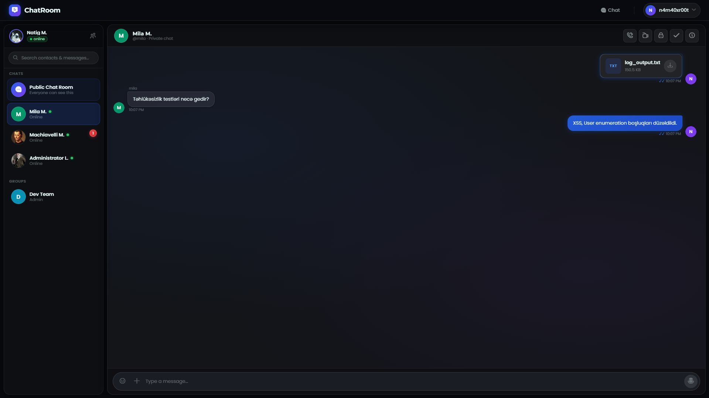
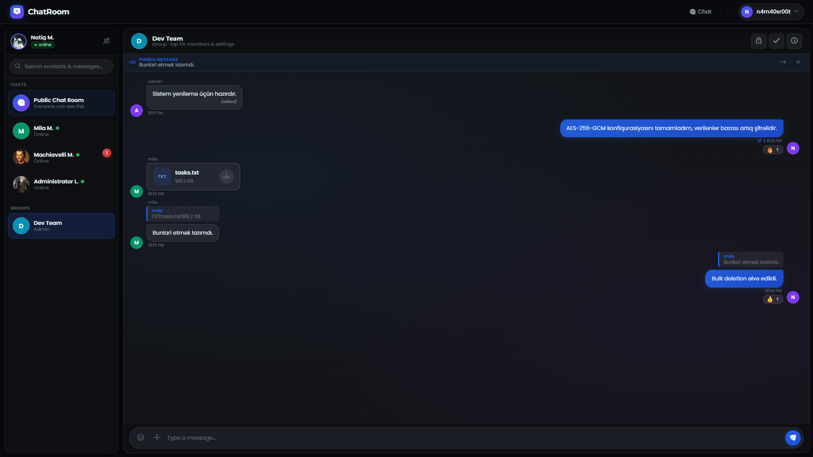
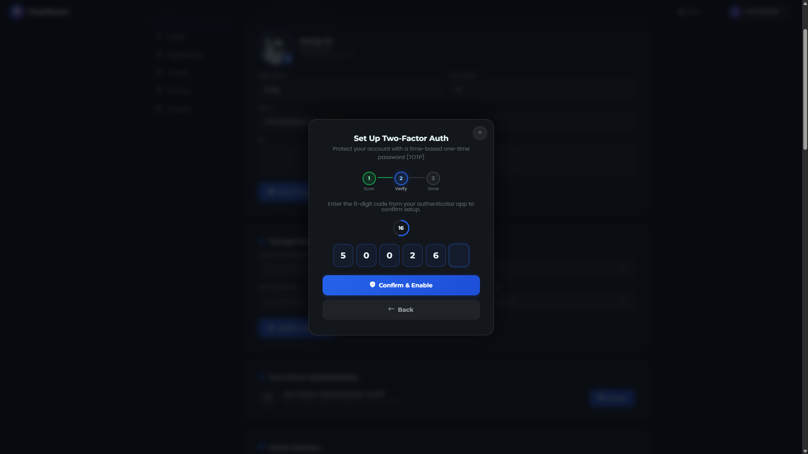
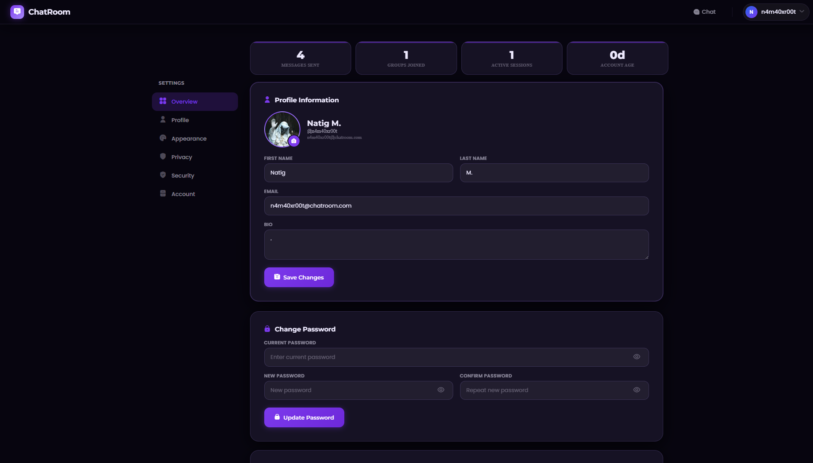
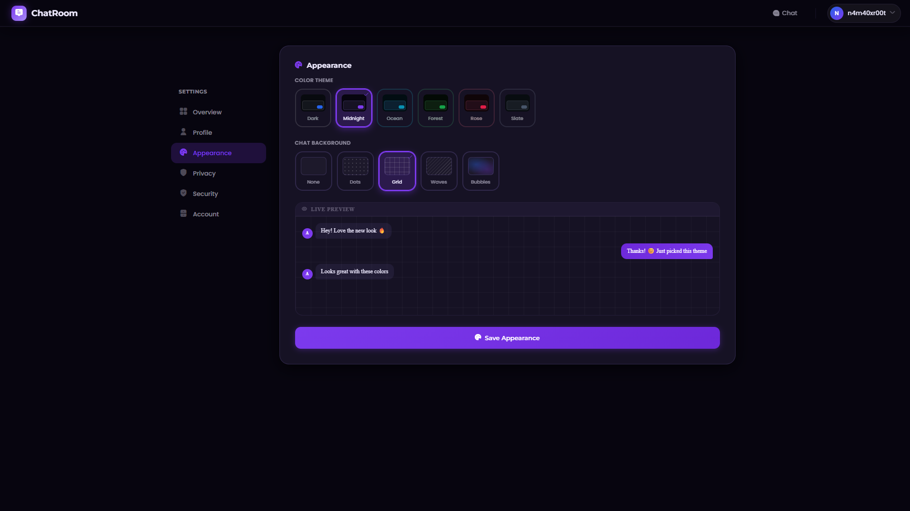
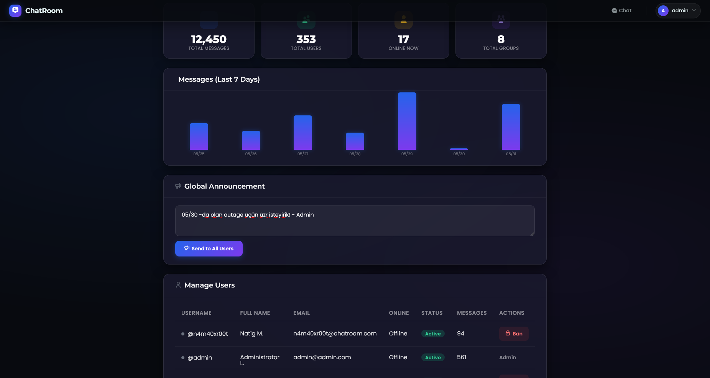
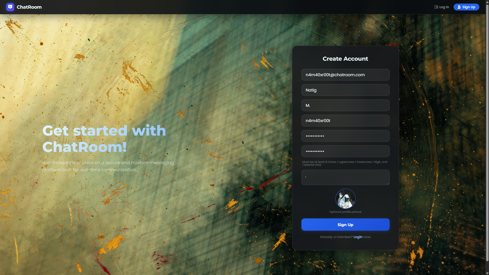

# ChatRoom — Secure Open Source Messaging Platform

A modern, fully responsive, real-time messaging application built with **Spring Boot 3.3**, **WebSockets (STOMP)**, and a custom dark-themed UI. Designed with a security-first mindset and production-ready architecture.


> 📸 **Main-Chat Interface**


---

## Features

### Messaging
- **Video & Voice Calling (WebRTC)** — Peer-to-peer video and audio calls directly inside the chat
- **Emoji Reactions** — React to individual messages with emojis in real-time
- Real-time private and public messaging via WebSocket / STOMP
- Group chats — create, manage members, share invite links
- Reply to messages with quoted preview (public, private & group)
- Message editing and deletion (delete for everyone / delete for me)
- Bulk message selection and deletion
- Scheduled messages (send at a future time)
- Voice messages (audio recording in-browser)
- Image sharing with full-screen preview
- Message forwarding
- Message pinning per chat
- In-chat search (right panel)
- Global search across all chats and messages
- Typing indicators
- Read receipts (delivered / read) with per-user tracking for group chats
- Unread message badges

> 📸 **Messaging interface**


### Security
- **Encryption at Rest: AES-256-GCM** encryption for all messages stored in the database (Note: This is server-side encryption at rest, not End-to-End Encryption)
- **BCrypt** password hashing
- **Multi-Factor Authentication (MFA/TOTP)** — Google Authenticator, Authy, etc.
- Brute-force protection with rate limiting (5 attempts -> 15-min lockout)
- Session fixation protection (session rotation on login)
- Active session management — view and remotely revoke any session
- Chat locks — secure individual conversations with a secondary PIN/password
- User blocking
- Input sanitization (XSS prevention on both client and server)
- WebSocket origin validation
- Secure session cookies (HttpOnly, SameSite=Lax)

### WebRTC Calls
- Peer-to-peer video and audio calling via native WebRTC APIs
- STOMP-based signaling (SDP offer/answer, ICE candidates)
- Incoming call notification with accept/decline
- Call ringing before connection
- Call timeout for unanswered calls (60s)
- Busy detection (prevents concurrent calls)
- Mute/unmute and camera toggle during active call
- Picture-in-picture local video layout
- Call history and statistics (total, answered, missed, duration)
- Stale session cleanup on crash or force-close


### Multi-Factor Authentication
- TOTP-based MFA (RFC 6238, 6-digit codes, 30-second window)
- QR code generation for authenticator app setup
- Step-by-step wizard: Scan -> Verify -> Done
- Disable with password confirmation
- MFA login flow with session rotation
- 30-second countdown ring on OTP input

> 📸 **MFA intallation wizard**


### Appearance
- 6 built-in themes: Dark, Midnight, Ocean, Forest, Rose, Slate
- 5 chat background patterns: None, Dots, Grid, Waves, Bubbles
- Theme preferences stored per user in the database
- Instant live preview without page reload
- **Real-time mini chat preview** on the settings page — mock conversation bubbles update instantly as you pick themes and backgrounds
- Zero flash on load (theme applied server-side via Thymeleaf + synced to localStorage)

> 📸 **Settings page**


### Profile & Settings
- Profile photo upload (PNG/JPG/WebP/GIF, max 5 MB, stored as base64)
- Bio, name, surname, email editing
- Password change with policy enforcement
- Active sessions list with per-session revoke modal
- MFA setup/disable from settings page
- Theme & chat background picker with **real-time mini chat preview**
- **Staggered fade-in card animations** with hover lift/glow effects on all setting panels
- Invite link generation and acceptance

> 📸 **Settings page**


### Contact & Group Management
- Invitation link system (one-time-use tokens)
- Auto-add contacts when starting a private chat
- Right panel shows shared groups with a contact
- Delete entire conversation (password-confirmed, irreversible)
- Group admin panel — add/remove members, rename, change photo
- Leave group

### Admin Dashboard
- User management — ban / unban
- Global announcements (broadcast to public chat)
- Stats: total messages, users, online count, groups
- 7-day message activity chart

> 📸 **Admin Dashboard**


---

## Architecture

ChatRoom uses a **hybrid architecture** combining REST APIs with WebSocket/STOMP for real-time bidirectional communication.

### Request Flow

```
                         ┌──────────────────┐
                         │   Client Browser  │
                         │ (Thymeleaf + JS)  │
                         └──────┬───────┬───┘
                                │       │
                   ┌────────────┘       └────────────┐
                   ▼                                  ▼
          ┌────────────────┐              ┌──────────────────────┐
          │  REST / API    │              │  WebSocket / STOMP   │
          │  (Controller)  │              │  (ChatController)    │
          │                │              │                      │
          │ • Page routes  │              │ • /chatroom/public   │
          │ • CRUD ops     │              │ • /user/private      │
          │ • Auth/Session │              │ • /call/signal       │
          │ • Admin        │              │ • Typing / reactions │
          └───────┬────────┘              └──────────┬───────────┘
                  │                                  │
                  └──────────────┬───────────────────┘
                                 ▼
                        ┌────────────────┐
                        │  Spring Data   │
                        │  JPA / Hibernate│
                        └───────┬────────┘
                                │
                                ▼
                        ┌────────────────┐
                        │    Database     │
                        │ (H2 / PG / MySQL)│
                        └────────────────┘
```

### Key Design Decisions

- **REST** handles page navigation, settings, admin, file uploads, and all CRUD operations
- **WebSocket/STOMP** handles real-time event flows: messaging, typing indicators, call signaling, reactions, and read receipts
- **Per-user private queues** (`/user/{username}/private`) deliver targeted messages including group messages fan-out
- **AES-256-GCM encryption at rest** via a JPA `AttributeConverter` — messages are encrypted before storage and decrypted on read
- **Server-side sessions** with Spring Session — no JWT, supporting active session revocation
- **TOTP MFA** as an optional second factor using RFC 6238

---

## Technology Stack

| Layer | Technology |
|---|---|
| Backend | Java 21, Spring Boot 3.3.5 |
| Security | Spring Security 6, BCrypt, AES-256-GCM |
| MFA | dev.samstevens.totp:totp:1.7.1, ZXing QR (core + javase 3.5.3) |
| Real-time | Spring WebSocket, STOMP, SockJS |
| Persistence | Spring Data JPA, Hibernate 6, PostgreSQL |
| Templates | Thymeleaf 3 |
| Frontend | Vanilla JS, jQuery (local), SockJS, Stomp.js, Emoji Mart 5.6.0 |
| WebRTC | Native browser APIs (RTCPeerConnection, getUserMedia) |
| Fonts | Montserrat, Poppins (Google Fonts) |
| Icons | Flaticon UIcons |
| Build | Maven Wrapper (mvnw) |
| IDE | IntelliJ IDEA |

---

## Getting Started

### Prerequisites
- **JDK 21** or higher

### 1. Clone the repository
```bash
git clone https://github.com/your-username/ChatRoom.git
cd ChatRoom/ChatSystem/ChatSystem
```

### 2. Prerequisites
- **PostgreSQL 14+** installed and running on `localhost:5432`
- Create a database and user:

```bash
psql -U postgres -c "CREATE DATABASE chatroom;"
psql -U postgres -c "CREATE USER chatroom_user WITH PASSWORD 'your_password';"
psql -U postgres -c "GRANT ALL PRIVILEGES ON DATABASE chatroom TO chatroom_user;"
```

### 3. Configure secrets

Edit `src/main/resources/application.properties` and override the sensitive values. At minimum, change:

```properties
# Generate with: openssl rand -base64 32
app.encryption.secret=${APP_ENCRYPTION_SECRET:change_me_in_production}

# PostgreSQL connection (via env var)
spring.datasource.url=${DATABASE_URL:jdbc:postgresql://localhost:5432/chatroom}
```

> **Never commit your real `application.properties` with secrets.** Use environment variables in production:
> ```bash
> export APP_ENCRYPTION_SECRET=your_key
> export SPRING_DATASOURCE_PASSWORD=your_password
> ```

### 4. Build
```bash
./mvnw clean package -DskipTests
```

### 5. Run
```bash
./mvnw spring-boot:run
```

By default, the app starts on **HTTP port 8080**.
If you wish to run with HTTPS natively, you must generate a `keystore.p12` and use the `https` profile.

### 6. Open
```
http://localhost:8080
```

> 📸 **Login / Sign-Up page**


---

## Deploying to Render Cloud

This project is pre-configured to be deployed seamlessly as a Web Service on [Render](https://render.com).

1. **Create a PostgreSQL Database** on Render and copy the `Internal Database URL`.
2. **Create a Web Service** linked to your GitHub repository.
3. **Environment Settings**: 
   - Runtime: `Java`
   - Build Command: `./mvnw clean package -DskipTests`
   - Start Command: `java -jar ChatSystem/ChatSystem/target/ChatSystem-0.0.1-SNAPSHOT.jar` (or update based on your exact working directory)
4. **Environment Variables**: Add the following:
   - `DATABASE_URL`: *(paste the Internal Database URL from step 1)*
   - `APP_ENCRYPTION_SECRET`: *(generate a secure random 32-byte base64 string)*
   - `SPRING_PROFILES_ACTIVE`: `http` (Render handles HTTPS automatically)
   
Render will automatically pass the `PORT` and `DATABASE_URL` variables to the application.

---

## Testing

Run the test suite with Maven:

```bash
./mvnw test
```

The project includes:

| Test | File | Purpose |
|------|------|---------|
| Context Load | `ChatSystemApplicationTests.java` | Verifies Spring context starts successfully |
| MFA Service | `MfaServiceTest.java` | Unit tests for TOTP generation and verification |

---

## Configuration Reference

| Property | Default | Description |
|---|---|---|
| `app.encryption.secret` | (dev key) | Base64-encoded 32-byte AES key. **Change in production.** |
| `spring.datasource.url` | `jdbc:postgresql://localhost:5432/chatroom` | PostgreSQL JDBC URL. |
| `spring.datasource.username` | `chatroom_user` | PostgreSQL user. **Change in production.** |
| `spring.datasource.password` | (dev password) | PostgreSQL password. **Change in production.** |
| `app.allowed-origins` | `*` | Comma-separated WebSocket allowed origins. Restrict in production. |
| `app.max-message-length` | `10000` | Max text message length in characters. |
| `app.max-image-bytes` | `5242880` | Max image size in bytes (5 MB). |
| `server.servlet.session.timeout` | `30m` | Session inactivity timeout. |
| `spring.jpa.hibernate.ddl-auto` | `update` | Use `validate` or `none` in production after first run. |

---

## Database

The project uses **PostgreSQL 14+** as its primary database. The schema is auto-created on first run via Hibernate's `ddl-auto=update`.

Create the database before first launch:

```bash
psql -U postgres -c "CREATE DATABASE chatroom;"
psql -U postgres -c "CREATE USER chatroom_user WITH PASSWORD 'your_password';"
psql -U postgres -c "GRANT ALL PRIVILEGES ON DATABASE chatroom TO chatroom_user;"
```

---

## API Reference

### REST Endpoints

All REST endpoints are prefixed with `/api`.

#### Contacts
| Method | Path | Description |
|--------|------|-------------|
| GET | `/api/contacts` | List user's contacts (with presence, unread counts) |
| POST | `/api/contacts/{username}` | Add a contact |

#### Messaging
| Method | Path | Description |
|--------|------|-------------|
| GET | `/api/messages/{contact}` | Get private chat history |
| GET | `/api/messages/search?q=` | Global message search |
| POST | `/api/messages/forward` | Forward a message to users/groups |
| POST | `/api/messages/{id}/pin` | Pin a message |
| POST | `/api/messages/{id}/unpin` | Unpin a message |
| GET | `/api/messages/pinned?type=&id=` | Get pinned message for a chat |
| POST | `/api/messages/{id}/delete-for-me` | Soft-delete message for current user |
| GET | `/api/messages/{id}/thread` | Get message thread |
| GET | `/api/messages/{id}/read-by` | Get users who read a group message |
| GET | `/api/messages/group/{groupId}` | Get group message history |

#### Reactions
| Method | Path | Description |
|--------|------|-------------|
| GET | `/api/messages/{id}/reactions` | Get reaction summary |
| POST | `/api/messages/{id}/reactions` | Add/replace reaction |
| DELETE | `/api/messages/{id}/reactions/{emoji}` | Remove reaction |
| POST | `/api/messages/reactions/batch` | Batch fetch reactions (up to 200 IDs) |

#### Users
| Method | Path | Description |
|--------|------|-------------|
| GET | `/api/users/{username}` | Get user info |
| GET | `/api/users/{username}/shared-groups` | Get shared groups with user |
| GET | `/api/user/{username}/profile` | Get user profile |

#### Groups
| Method | Path | Description |
|--------|------|-------------|
| GET | `/api/groups` | List user's groups |
| POST | `/api/groups` | Create group |
| GET | `/api/groups/{id}` | Get group details + members |
| PATCH | `/api/groups/{id}` | Update group name/photo |
| POST | `/api/groups/{id}/members` | Add member |
| DELETE | `/api/groups/{id}/members/{username}` | Remove member |
| POST | `/api/groups/{id}/leave` | Leave group |
| POST | `/api/groups/{id}/invite` | Generate group invite link |
| POST | `/api/groups/invite/accept/{token}` | Accept group invite |

#### Invitations
| Method | Path | Description |
|--------|------|-------------|
| POST | `/api/invite/generate` | Generate invite link |
| POST | `/api/invite/accept/{token}` | Accept invite |

#### Blocks
| Method | Path | Description |
|--------|------|-------------|
| GET | `/api/blocks` | List blocked users |
| POST | `/api/blocks/{username}` | Block user |
| DELETE | `/api/blocks/{username}` | Unblock user |

#### Settings
| Method | Path | Description |
|--------|------|-------------|
| POST | `/api/settings/update` | Update profile (name, bio, photo) |
| POST | `/api/settings/theme` | Set theme & chat background |
| GET | `/api/settings/theme` | Get current theme |
| POST | `/api/settings/privacy` | Update privacy settings |
| GET | `/api/settings/privacy` | Get privacy settings |
| POST | `/api/settings/update-password` | Change password |
| GET | `/api/settings/stats` | Get personal statistics |
| GET | `/api/settings/export` | Export user data (JSON) |
| DELETE | `/api/settings/account` | Delete account |
| DELETE | `/api/settings/conversations/all` | Clear all conversations |
| DELETE | `/api/conversations/{username}` | Delete conversation with password |

#### Files
| Method | Path | Description |
|--------|------|-------------|
| POST | `/api/upload` | Upload file (image/doc/audio/video) |

#### Admin
| Method | Path | Description |
|--------|------|-------------|
| GET | `/api/admin/users` | List all users |
| POST | `/api/admin/ban/{username}` | Ban user |
| POST | `/api/admin/unban/{username}` | Unban user |
| GET | `/api/admin/stats` | Get system statistics |
| POST | `/api/admin/announce` | Send global announcement |

### WebSocket Endpoints

| Destination | Direction | Description |
|-------------|-----------|-------------|
| `/ws` | Connect | STOMP/SockJS WebSocket endpoint |
| `/app/message` | Send → | Public chat message |
| `/app/private-message` | Send → | Private message |
| `/app/group-message` | Send → | Group message |
| `/app/message-delivered` | Send → | Mark message as delivered |
| `/app/message-read` | Send → | Mark message as read |
| `/app/edit-message` | Send → | Edit a message |
| `/app/delete-message` | Send → | Delete a message |
| `/app/bulk-delete-messages` | Send → | Bulk delete messages |
| `/app/message-delivered` | Send → | Mark message delivered |
| `/app/message-read` | Send → | Mark message read |
| `/app/typing` | Send → | Typing indicator |
| `/app/schedule-message` | Send → | Schedule a message |
| `/chatroom/public` | ← Receive | Public chat broadcast |
| `/user/{username}/private` | ← Receive | Per-user private/group queue |
| `/call/signal` | ↔ | WebRTC signaling |

---

## Production Checklist

- [ ] Change `app.encryption.secret` to a freshly generated key
- [ ] Change `spring.datasource.password`
- [ ] Set `app.allowed-origins` to your actual domain
- [ ] Enable `server.servlet.session.cookie.secure=true` (requires HTTPS)
- [ ] Set `spring.jpa.hibernate.ddl-auto=validate`
- [ ] Set `spring.jpa.hibernate.ddl-auto=validate` after schema is stable
- [ ] Run behind a reverse proxy (nginx/Caddy) with TLS
- [ ] Set `server.servlet.session.cookie.same-site=strict` for stricter CSRF protection

---

## Docker Support

Run ChatRoom in a containerized environment:

```dockerfile
# Dockerfile
FROM maven:3.9-eclipse-temurin-21 AS build
WORKDIR /app
COPY ChatSystem/ChatSystem/pom.xml .
COPY ChatSystem/ChatSystem/src ./src
RUN mvn clean package -DskipTests

FROM eclipse-temurin:21-jre
WORKDIR /app
COPY --from=build /app/target/ChatSystem-0.0.1-SNAPSHOT.jar app.jar
EXPOSE 8443
ENTRYPOINT ["java", "-jar", "app.jar"]
```

```yaml
# docker-compose.yml
services:
  db:
    image: postgres:14
    environment:
      - POSTGRES_DB=chatroom
      - POSTGRES_USER=chatroom_user
      - POSTGRES_PASSWORD=your_db_password
    volumes:
      - pgdata:/var/lib/postgresql/data
    healthcheck:
      test: ["CMD-SHELL", "pg_isready -U chatroom_user -d chatroom"]
      interval: 5s
      timeout: 5s
      retries: 5

  chatroom:
    build: .
    ports:
      - "8443:8443"
      - "8080:8080"
    environment:
      - APP_ENCRYPTION_SECRET=your_base64_32byte_key
      - SPRING_DATASOURCE_PASSWORD=your_db_password
      - APP_ALLOWED_ORIGINS=https://yourdomain.com
      - SPRING_DATASOURCE_URL=jdbc:postgresql://db:5432/chatroom
    depends_on:
      db:
        condition: service_healthy
    restart: unless-stopped

volumes:
  pgdata:
```

---

## Project Structure

```
ChatSystem/
├── src/main/java/com/chtsys/ChatSystem/
│   ├── ChatSystemApplication.java        # Spring Boot entry point
│   ├── config/
│   │   ├── SecurityConfig.java           # Spring Security, CSRF, session
│   │   ├── WebSocket.java                # STOMP/WebSocket configuration
│   │   ├── WebSocketEventListener.java   # WS connect/disconnect handlers
│   │   ├── WebSocketAuthHandshakeInterceptor.java  # Username binding
│   │   ├── WebMvcConfig.java             # Interceptor registration
│   │   ├── SessionInterceptor.java       # Session validation interceptor
│   │   ├── LoginRateLimiter.java         # Brute-force protection
│   │   ├── EncryptionUtil.java           # AES-256-GCM crypto utility
│   │   ├── MessageCryptoConverter.java   # JPA attribute converter
│   │   ├── MfaService.java               # TOTP/QR code generation
│   │   ├── CallTimeoutScheduler.java     # Unanswered call cleanup
│   │   └── HttpsRedirectConfig.java      # HTTP -> HTTPS redirect
│   ├── controller/
│   │   ├── PageController.java           # Page routing (login, chat, settings, admin...)
│   │   ├── ApiController.java            # REST API (contacts, messages, admin, profile...)
│   │   ├── ChatController.java           # WebSocket (public/private/group messaging)
│   │   ├── GroupChatController.java      # REST (groups CRUD, invites, history)
│   │   ├── CallController.java           # WebSocket (WebRTC signaling)
│   │   ├── CallApiController.java        # REST (call history, stats, cleanup)
│   │   ├── MfaController.java            # MFA login flow + REST setup
│   │   ├── SessionController.java        # REST (active session management)
│   │   └── ChatLockController.java       # REST (chat locking/unlocking)
│   ├── Model/
│   │   ├── UserEntity.java, ChatMessage.java, Message.java (DTO)
│   │   ├── Contact.java, UserBlock.java, Invitation.java
│   │   ├── ChatGroup.java, GroupMember.java, GroupRole.java
│   │   ├── CallSession.java, CallSignal.java (DTO)
│   │   ├── MessageReaction.java, MessageReadReceipt.java
│   │   ├── DeletedMessageForUser.java, ChatLock.java
│   │   ├── UserSession.java, ScheduledMessage.java
│   │   └── Status.java (enum)
│   ├── repository/                       # Spring Data JPA repositories (14 total)
│   └── service/
│       └── ScheduledMessageService.java  # Cron-based scheduled delivery
└── src/main/resources/
    ├── application.properties            # Main config (profiles: http / https)
    ├── application-http.properties       # HTTP profile (port 8080)
    ├── application-https.properties      # HTTPS profile (port 8443, SSL)
    ├── keystore.p12                      # Self-signed SSL cert (dev only)
    ├── templates/                        # Thymeleaf pages
    │   ├── login.html, create-account.html, mfa-verify.html
    │   ├── chat.html, call.html, settings.html, admin.html
    │   └── header.html (fragment)
    └── static/
        ├── css/
        │   ├── variables.css, reset.css, themes.css, header.css
        │   ├── loading.css, home.css, chat.css, call.css
        │   ├── settings.css, mfa.css, admin.css
        ├── js/
        │   ├── jquery.js, theme.js, loading.js
        │   ├── chat.js (~4800 lines), settings.js, webrtc-call.js
        │   └── call-integration.js
        └── images/ (profiles/, bg/)
```

---

## Contributing

Contributions are welcome! Please:

1. Fork the repository
2. Create a feature branch: `git checkout -b feature/your-feature`
3. Commit your changes: `git commit -m 'Add your feature'`
4. Push to the branch: `git push origin feature/your-feature`
5. Open a Pull Request

Please make sure your code follows the existing style and does not introduce security regressions.

---

## License

This project is licensed under the **MIT License** — see the [LICENSE](LICENSE) file for details.

---

## Future Roadmap — Suggested Features

Below is a curated list of features that would meaningfully improve ChatRoom, ordered by estimated impact. Each item includes concrete implementation guidance.

### High Priority

#### 1. End-to-End Encryption via Per-User Key Derived from Password
Replace server-side AES-256-GCM with true E2EE where the server cannot read message contents. Each user's encryption key is derived from their password on the client side — the server never has access to the raw key.

- On registration/change password: derive a 256-bit key using **Argon2** (or PBKDF2 with SHA-256) from the user's password *in the browser*. Encrypt this key with the server's public RSA key and store it on the server as the **wrapped key** — the server stores it but cannot unwrap it without the password.
- On login: re-derive the key from the password in the browser, use it to unwrap the stored key material via **Web Crypto API** (`SubtleCrypto.unwrapKey`). Keep the key in memory (never persisted to localStorage).
- Before sending a message: encrypt the plaintext with the recipient's public key (or a shared conversation key) using **AES-256-GCM** on the client. The server receives and stores only ciphertext.
- Before rendering a message: decrypt incoming ciphertext using the in-memory key.
- For group chats: use a symmetric group key that is encrypted with each member's public key and distributed via the server as key-wrapped payloads — members can decrypt the group key with their own key.
- Remove the global `app.encryption.secret` property and `MessageCryptoConverter` — server-side encryption is no longer needed since the server only stores ciphertext it cannot read.
- Implement key rotation, recovery mechanisms (e.g., a one-time recovery code printed during setup), and a trust-on-first-use (TOFU) model for public key verification.

#### 2. Push Notifications (PWA)
Browser push notifications when the app is in the background or closed.

- Register a **Service Worker** (`sw.js`) using the Push API + Notification API
- Use the [web-push](https://github.com/web-push-libs/webpush-java) Java library for VAPID-signed push messages
- Store push subscriptions in a new `PushSubscription` entity
- Trigger a push from `ChatController` when a message targets an offline user

### Medium Priority

#### 3. Full-Text Search with Highlighting
Replace `LIKE` queries with indexed search and keyword highlighting.

- Integrate **Hibernate Search + Lucene** for full-text indexing of message content
- Expose `GET /api/messages/search?q=&from=&to=&sender=` with pagination
- Highlight matched terms in the search results

#### 4. Link Previews
When a URL is sent, show a rich preview card (title, description, thumbnail).

- Add `POST /api/link-preview?url=` — use **jsoup** to scrape Open Graph meta tags
- Cache results in an in-memory map to avoid re-fetching
- Render the preview card below the message bubble

#### 5. Message Translation
Translate any message to the user's preferred language with one click.

- Integrate **LibreTranslate** (self-hosted, free) or DeepL / Google Translate API
- Add a "Translate" option to the message context menu
- Show translated text inline below the original with a "Show original" toggle

### Lower Priority

#### 6. Message Reminders
Set a reminder on any message — get a notification at a chosen time.

- Add a `MessageReminder` entity: `(userId, messageId, remindAt)`
- Use Spring's `@Scheduled` task (every minute) to check for due reminders
- Push reminders via WebSocket
- "Remind me" option in the message context menu -> datetime picker

#### 7. Native Mobile App (React Native / Flutter)
A dedicated iOS/Android app using the existing REST + WebSocket API.

- Build with **React Native** or **Flutter**
- Use `stomp_dart_client` (Flutter) or `@stomp/stompjs` (React Native) for WebSocket
- Implement push notifications via **Firebase Cloud Messaging (FCM)**

---

## FAQ

**Q: Is there End-to-End Encryption?**
A: Currently messages are encrypted at rest using AES-256-GCM on the server side. Messages are decrypted before being sent to clients over WebSocket. True E2EE (where the server cannot read messages) requires client-side encryption and is on the roadmap.

**Q: Which browsers are supported?**
A: Chrome, Firefox, Edge, and Safari (latest 2 major versions). WebRTC calls require a secure context (HTTPS or localhost).

**Q: How do I set up the PostgreSQL database?**
A: See the [Database](#database) and [Getting Started](#getting-started) sections. Create the database and user with `psql`, then the schema is auto-created on first launch.

**Q: How do I enable HTTPS for production?**
A: The recommended approach is to run the app behind a reverse proxy (like Nginx, Caddy, or a cloud provider like Render) which handles HTTPS. If you want Spring Boot to handle it natively, provide your own `keystore.p12` and activate the `https` profile.

**Q: How do I reset the admin password?**
A: The admin account is created automatically on first run using values from `application.properties`. To reset, run `psql -U chatroom_user -d chatroom -c "UPDATE users SET password='<bcrypt_hash>' WHERE username='admin';"` or change it via the settings page if logged in.

**Q: Can I use this for production?**
A: Yes, but review the [Production Checklist](#production-checklist) first. The default settings use self-signed SSL certs and dev encryption keys that must be changed.

**Q: How do I run without HTTPS?**
A: Use the HTTP profile: `./mvnw spring-boot:run -Dspring-boot.run.profiles=http`

**Q: Does it support voice/video calls on mobile browsers?**
A: Yes, WebRTC calls work on mobile Chrome and Safari, but HTTPS is required (except on localhost).

---

## Author

Built by **n4m40xr00t** — feel free to reach out or open an issue.
